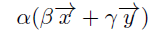
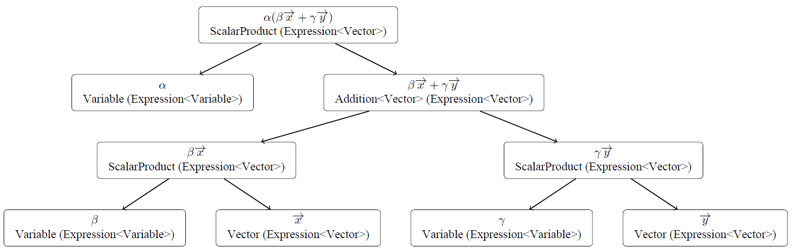
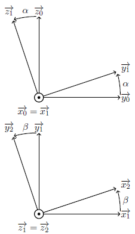

# SI-Helper

This is computer algebra program, designed to help in dynamics' calculation.

## Process architecture

### How it works

An expression can be a 'variable' expression, or an 'vector' expression. In a 'variable'
expression only variable can be manipulated, contrariwise in a 'vector' expression only
vector can be manipulated. The nature of an expression does not change the way it works.

Each expression is an interlocking of sub-expression. Each sub-expression can be a basic
one, or an operation (called 'function'). This is achieved by creating an [interface](src/fr/seb/Expression.java)
that have all the typical properties, and then creating basic expression and function
that implement this interface.

Currently, the [basic expression](src/fr/seb/vectors) are :
 - variable (only for 'variable' expression)
 - vector (only for 'vector' expression)

The [functions](src/fr/seb/function) are :
 - Addition (both)
 - Derivation (both, but needs a space where the derivation is made for vectors)
 - WedgeProduct (only for vectors)
 - Product (only for variables)
 - Cos & Sin (only for variables)
 - Scalar (only for variables)
 - ScalarProduct (only for variables)
 - Power (only for variables)
 - *~~Quotient~~ (could be removed in a near future)*

### Example

So you might ask yourself what this mean in practice.

For instant, here is how the program represent : 



### Advantages & Disadvantages

There is a few advantages to represent things with this system. First, every calculation can
be done recursively by iterating throw each node. Also, by making the calculation process
recursive, it's possible to show calculation steps to the user (by limiting the recursion
depth).

_This part needs to be reviewed_\
However, there is a big counterpart to these advantages : a same expression have multiple
way to be decomposed in sub-expression by the program, making it difficult to compare and
simplify expressions. This is not obvious in the example above but with, for example,
"a \times b \times c" the program can see it as "a \times (b \times c)" but also as 
"(a \times b) \times c".

## Basic use (an example)

_This example was made on a previous version, there are minor differences._

```java
// initiate two variables for the angle
Variable alpha = new Variable("\\alpha", new boolean[]{false, false, false, true});
Variable beta = new Variable("\\beta", new boolean[]{false, false, false, true});

// initiate two distances
Variable a = new Variable("a", new boolean[]{true});
Variable b = new Variable("b", new boolean[]{true});

Space R0 = new FixedSpace(); // the main space

// A spinning space around the x axis with \alpha
Space R1 = new SpinningSpace(R0, 1, R0.getFixedPoint(), VECTOR.X, VECTOR.X, alpha, VECTOR.Y, VECTOR.Y);

// create A point so that \vec{OA} = a \vec{y} 
Point A = new Point("A", R0.getFixedPoint(), new ScalarProduct(a, R1.getUnitaryVector(VECTOR.Y)));

// A spinning space around the z axis with \beta
Space R2 = new SpinningSpace(R1, 2, A, VECTOR.Z, VECTOR.Z, beta, VECTOR.X, VECTOR.X);

// create G point so that \vec{AG} = b \vec{x} 
Point G = new Point("G", A, new ScalarProduct(b, R2.getUnitaryVector(VECTOR.X)));

// Calculate velocity of G in R2 compared to R0
Velocity v = new Velocity(G, R2);
Expression<Vector> velocityExpression = v.calculate(R0).calcul();
pl(velocityExpression);

pl("");

// Calculate acceleration of G in R2 compared to R0 
pl(velocityExpression.derive(R0).calcul());
````
The spinning spaces give these figures :



At the end the console gives the expression of the acceleration of G in R2 compared to R0 !

## ToDo

1) use the invertSign/hasMinus properties. Maybe make invertSign return a clone expression
   with the sign invert. This ensures that inverting the sign will not modify an expression use 
   else where, but the clear disadvantage is that the same object will be viewed differently.
   Or create a clone function (and clone before inverting sign in the code). By adding a field
   in the clone element to refer the to father element, it would be possible to identify
   same object by looking to the first alias.
1) Test the new architecture
2) IntertiaMatrix class; AngularMomentum class; Torque class
4) A review of `calcul()` function usage
5) An algorithm that simplify expressions
3) The wiki
5) A latex document generator


## Contributions

Contributions/Comments/Suggestions are welcome. I don't know everything, and I
might have made overcomplicated or not optimised things. The only thing that you need to
think when contributing is that I want this program to be able to do the calculations and 
display the steps.

## Thanks
- [Moxinilian](https://github.com/Moxinilian) *for the help and advices* 
- Quentin R., Mathis P. & Alice G.  *for their support*

\
\
\
*Develop by Sébastien K.*
